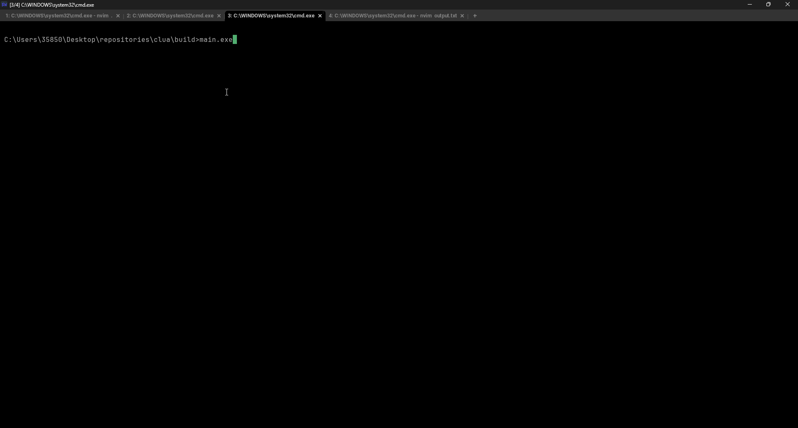
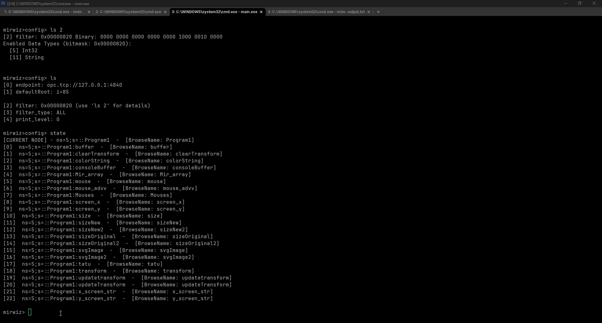
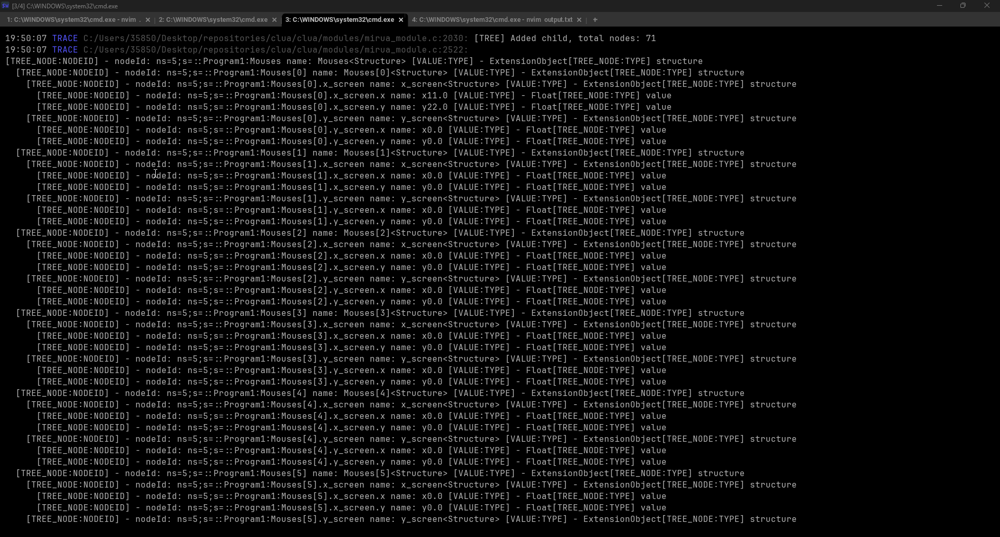
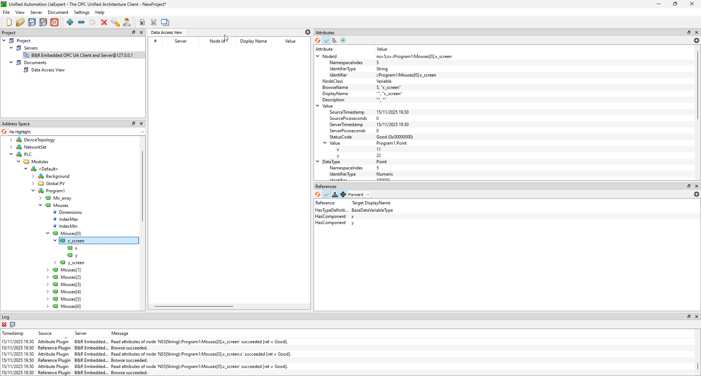

# Clua

Clua is OPC UA command line tool for browsing server and saving nodeids for telegraf opc ua .conf file made in C. Handles structures, arrays and primitive types. tested only with B&R opcua server.
## Disclaimer

C Learning repository. AI has touched the code. Memory leaks present. bad code present.

## Browse and save

## config

## structure


### Prerequisites
Relies on open62541 for opc ua client. 

### Build Instructions
```bash
git clone https://github.com/yourusername/clua.git
cd clua
build.bat
```